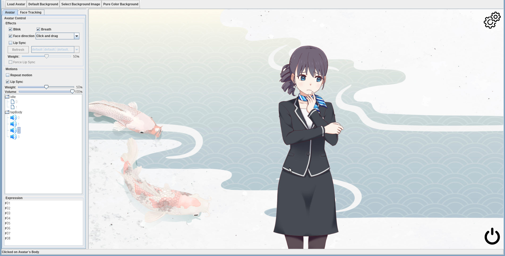
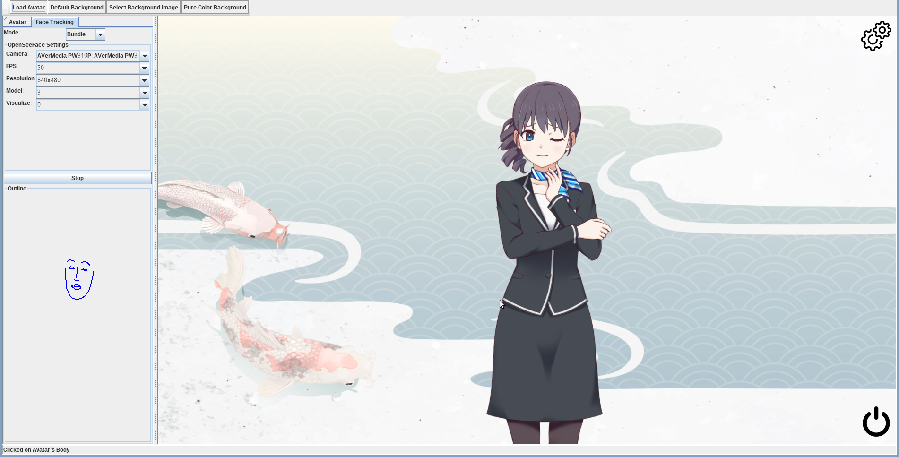
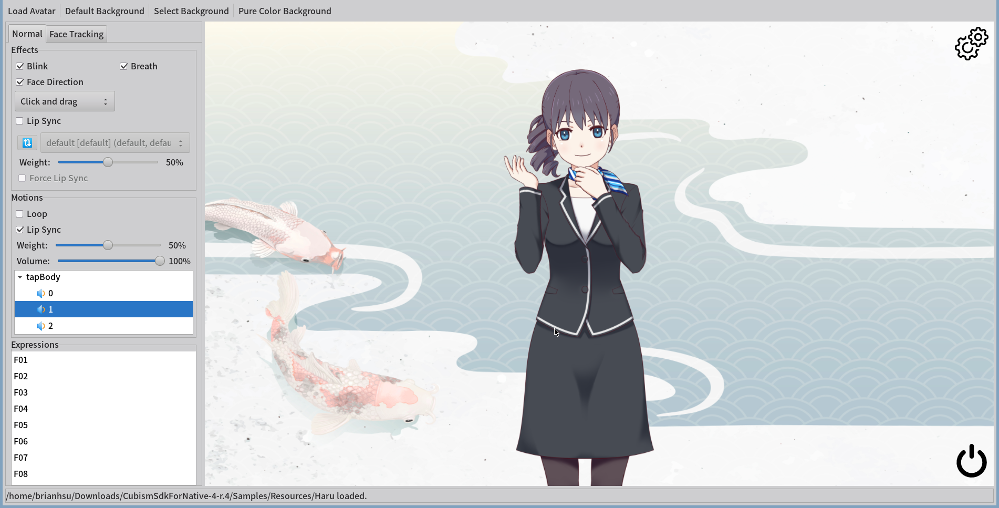
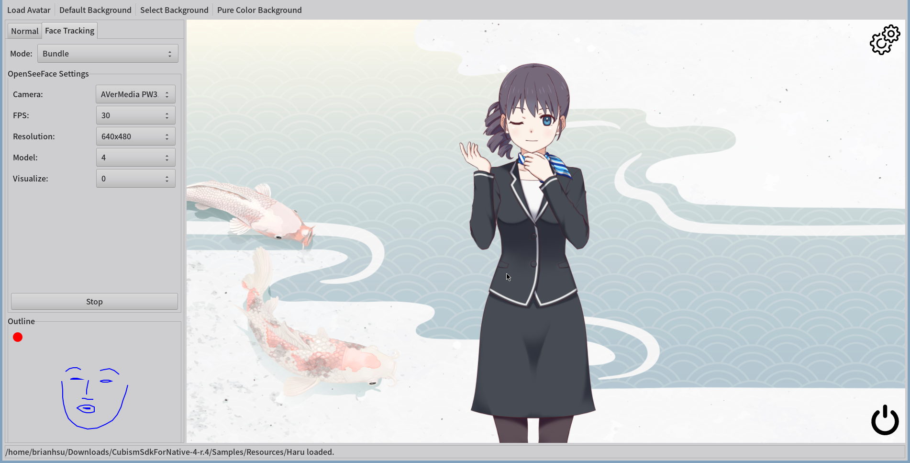

Live2D For Scala (JVM / Linux / Windows / MacOS Intel)
================================================
[](https://github.com/brianhsu/mavenRepository/) 

 


[ENGLISH](README.md)  [日本語](README.ja_JP.md)  [简体中文](README.zh_CN.md)
--
免責事項
-----------

  1. このプロジェクトは、LIVE2D Inc.とは直接的または間接的な関連も认可も持っていません。
  2. このプロジェクトは、Scala/JVMでの本地方法の操作を学ぶことと、実際のシナリオでクリーンアーキテクチャを適用する方法を学ぶためのプロジェクトです。したがって、このプロジェクトの核心ライブラリは比較的完全ですが、公式のLIVE 2D Cubism SDKの代用品として考えるべきではありません。
  3. これらの点にあたり、私がこの题材に興味を持たなくなると、プロジェクトが中断される可能性があります。このプロジェクトを使用することには、自分の責任を持ってください。

背景
-----------


Linuxで良いWebcamとLive2Dプログラムの組み合わせがないことではっきりしています。[facial-landmarks-for-cubism][0]は機能的なプログラムを提供していますが、使用するためには、C++プログラムのパッチとビルド方法についての相当な知識が必要です。

このプロジェクトの最終的な目標は、Linuxの世界に[VTuber Studio][1]のようなものを提供することです。機能が少し少しであっても、良いアウト・オブ・ボックスの経験を提供するべきです。

このプロジェクトの考え方は、Robert C. Martin（アンクル・ボブ）によって提唱された[クリーンアーキテクチャ][2]を活用し、Scala/JVMで書かれているため、ソースコードの変更無しでLinux / Windows / MacOS Intel上で运行することができるようにすることです。

### 承认

このプロジェクトは[facial-landmarks-for-cubism][0]に深受其影响しています。具体的には、このプロジェクトではOpenSeeFaceのデータ点をLive2Dのパラメータに変換するアルゴリズムが[facial-landmarks-for-cubism][0]から移植されています。

画像
--------------------

### Swing + JOGL Version Under Linux




### SWT+LWJGL Version under Linux





特徴
--------------------

コアライブラリは、公式のCubism SDK for Nativeと同様の機能をサポートしています。そのサンプルアプリケーションも含まれます。
以下は、現在このプロジェクトがサポートしている機能や、実装予定の機能の一覧です。

### 公式のCubism SDK for Nativeに含まれる機能の一部を以下に示します。
- [x] 動画 (ループまたは一度の時間)
- [x] モデル動画イベントリスナー
- [x] 表情
- [x] 物理演算
- [x] 自動目を閉じる效果
- [x] 自動呼吸効果
- [x] 顔の向きをマウスで制御
- [x] アバター動画からの唇同步 (.WAV ファイル)


### 进阶機能には以下の機能が含まれています。
- [x] マイクロフォンからの唇同期
- [x] ウェブカムを使用してLive2Dアバターを制御する（VTuberのように）


### 实现しない機能
Cubism SDK for Native内のいくつかの機能は、VTuberプログラムを作成する際には実用的でないと考えて、削除される予定です。
以下は、そのような機能の一覧です。

  - 優先度モーションキュー

TODO List
--------------------

  - [ ]  UIを通じてOpenSeeFace -> Live2D モデル動画パラメーターのコントロール
  - [ ] 顔追跡に基づいたLive2Dモデルの体の動き

サポートされているプラットフォーム
-----

このプロジェクトは、クリーンアーキテクチャの概念上で構築され、Java仮想マシンで运行します。これにより、さまざまなJava OpenGLバインディングAPIを使用することができます。デフォルトでは、[JavaOpenGL][3]バインディングと[LWJGL][4] + [SWT][5]バインディングを提供しています。

理論上、異なるOpenGL JavaライブラリとGUIツールキットの組み合わせを使用することは可能ですが、このプロジェクトに付属するサンプルプログラムは以下の組み合わせを使用しています。

macOS上でSWTを使用して動作させることができず、いくつかの奇妙なバグのために、現在、只有在Intelプロセッサ上运行するmacOSをサポートしています。Apple M1チップのmacOSは現在サポートされていません。

| OS / Binding  | Architecture | OpenGL Binding     | GUI Toolkit |Supported          | Note
| ------------- |------------- | ------------------ |------------ |------------------ |------
| Linux         | x86_64       | JavaOpenGL         | Swing       |:heavy_check_mark: |
| Linux         | x86_64       | LWJGL              | SWT         |:heavy_check_mark: |
| Windows 10    | x86_64       | JavaOpenGL         | Swing       |:heavy_check_mark: |
| Windows 10    | x86_64       | LWJGL              | SWT         |:heavy_check_mark: |
| MacOS         | x86_64       | JavaOpenGL         | Swing       |:heavy_check_mark: | 1
| MacOS         | x86_64       | LWJGL              | SWT         |:x:                | 

1. jogamp-fat-v2.4.0-rc-20210111.jarを必須とする。Maven Centralから自動的に依存関係を引き込むことは機能しません。
   
インストールと使用方法
--------------------

詳細なインストール手順は、doc/INSTALL.md ファイルを参照してください。このファイルには、デモアプリケーションと使用するサンプルLive 2Dモデルの下载方法と使用方法の手順が記載されています。

デモアプリケーションのSwing版とSWT版は同じ機能を提供します。以下は、基本的な操作スキームのいくつかです。

1. 最上左手隅の「Load Avatar」ボタンをクリックして、Live2Dモデルを読み込みます。

    1.1 有効な`.moc3`ファイルを含むフォルダーを選択する必要があります。

2. 左側のユーザーパネルは、効果/動き/表情を制御するためのものです。
3. アバター上で右クリックし、アバターを移動するにはドラッグしてください。
4. マウスの滚轮を使用して、アバターをズームイン/ズームアウトすることができます。


プロジェクトの構造と設計
-----------------------------

このプロジェクトはクリーンアーキテクチャ设计理念に従っており、複数のモジュールに分かれています。これらのモジュールは全てmodulesディレクトリ下のSBTサブプロジェクトです。

以下は、このプロジェクトの構造の概览と、各モジュールについての簡単な説明です。

各コンポーネントの詳細なドキュメントや、このプロジェクトのコアライブラリを自分のプロジェクトで使用してライブ/Live2Dモデルのレンダリングを制御する方法についてはmodules/README.mdを参照してください。

```console
.
├── build.sbt   # SBTビルド定義
├── doc
├── modules     
│   ├── core         # Live2Dモデルを制御/レンダリングするためのコアライブラリ
│   ├── joglBinding  # Java OpenGLのバインディング
│   ├── lwjglBinding # LWJGLのバインディング
│   ├─── swtBinding  # SWT GLCanvasのバインディング
│   └──── examples
│      ├── base      # 任何のGUIツールキット依存を持たない基本的なデモアプリケーション
│      ├── swing     # 完全なSwingバージョンのデモアプリケーション
│      ├── swt       # SWTランタイムを持たないSWTバージョンのデモアプリケーション
│      ├── swt-linux-bundle   # Linux用SWTランタイムを含むSWTバージョンのデモアプリケーション
│      └── swt-windows-bundle # Windows用SWTランタイムを含むSWTバージョンのデモアプリケーション
├── publish.sbt # Mavenパブリッシュ設定
├── release.sbt # リリース設定
├── README.md  
└── version.sbt # バージョン設定
```

ビルド手順
--------------------


### 1. OpenJDK 11のインストール
- Windowsにおいて、[Microsoft Build of OpenJDK](https://docs.microsoft.com/en-us/java/openjdk/download)をダウンロードし、インストールしてください。
- Linuxにおいて、ディストリビューションの包管理器を使用してインストールしてください。
- macOSにおいて
    1. Homebrewをインストールしてください。
    2. `brew install openjdk@11`を実行してインストールしてください。
  
### 2. [SBT][6] (Simple Build Tool)のインストール


- SBTの[ダウンロード](https://www.scala-sbt.org/download.html)ページに記載されている手順に従ってインストールしてください。

### 3. コンパイル

1. SBTがインストールされた後、以下のコマンドを実行してGitHubからこのプロジェクトを克隆してください。（以上の上游プロジェクトを例に）

```console
username@hostname:~$ git clone https://github.com/brianhsu/Live2DForScala.git
Cloning into 'Live2DForScala'...
remote: Enumerating objects: 10853, done.
remote: Counting objects: 100% (30/30), done.
remote: Compressing objects: 100% (23/23), done.
remote: Total 10853 (delta 6), reused 22 (delta 1), pack-reused 10823
Receiving objects: 100% (10853/10853), 67.14 MiB | 7.30 MiB/s, done.
Resolving deltas: 100% (4483/4483), done.

username@hostname:~$
```

2. そのディレクトリに移動し、`sbt` をタイプしてSBTコンソールを実行してください。初めて実行するときは、ファイルのダウンロードに時間がかかるかもしれません。


```console
username@hostname:~$ cd Live2DForScala
username@hostname:~/Live2DForScala$ sbt
copying runtime jar...
[info] [launcher] getting org.scala-sbt sbt 1.5.8  (this may take some time)...
:: loading settings :: url = jar:file:/usr/share/sbt-bin/lib/sbt-launch.jar!/org/apache/ivy/core/settings/ivysettings.xml
:: loading settings :: url = jar:file:/usr/share/sbt-bin/lib/sbt-launch.jar!/org/apache/ivy/core/settings/ivysettings.xml
....
[info] welcome to sbt 1.5.8 (Eclipse Adoptium Java 11.0.15)
[info] loading global plugins from /home/brianhsu/.sbt/1.0/plugins
[info] loading settings for project live2dforscala-build from plugins.sbt ...
[info] loading project definition from /home/brianhsu/Live2DForScala/project
[info] loading settings for project core from build.sbt ...
[info] loading settings for project lwjglBinding from build.sbt ...
[info] loading settings for project live2dforscala from build.sbt,publish.sbt,version.sbt ...
[info] set current project to live2dforscala (in build file:/home/brianhsu/Live2DForScala/)
[info] sbt server started at local:///home/brianhsu/.sbt/1.0/server/7f96e432f44ce5ee45c1/sock
[info] started sbt server
sbt:live2dforscala> 
```

3. SBTコンソールで `compile` と入力してコンパイルしてください。


```console
sbt:live2dforscala> compile
[info] compiling 154 Scala sources and 1 Java source to /home/brianhsu/Live2DForScala/modules/core/target/scala-2.13/classes ...
[info] Non-compiled module 'compiler-bridge_2.13' for Scala 2.13.8. Compiling...
[info]   Compilation completed in 4.259s.
[info] compiling 2 Scala sources to /home/brianhsu/Live2DForScala/modules/lwjglBinding/target/scala-2.13/classes ...
[info] compiling 1 Scala source to /home/brianhsu/Live2DForScala/modules/swtBinding/target/scala-2.13/classes ...
[info] compiling 3 Scala sources to /home/brianhsu/Live2DForScala/modules/joglBinding/target/scala-2.13/classes ...
[info] compiling 7 Scala sources to /home/brianhsu/Live2DForScala/modules/examples/base/target/scala-2.13/classes ...
[info] compiling 8 Scala sources to /home/brianhsu/Live2DForScala/modules/examples/swt/target/scala-2.13/classes ...
[info] compiling 8 Scala sources to /home/brianhsu/Live2DForScala/modules/examples/swing/target/scala-2.13/classes ...
sbt:live2dforscala> 
```

### 4. テスト

- SBTコンソールで test と入力して单元テストを実行してください。
- MacOSはSWT+JWJGLをサポートしていないため、SWTOpenGLCanvasInfoFeatureは失敗するでしょう。これは予想される现象です。

```console
sbt:live2dforscala> test
[info] compiling 1 Scala source to /home/brianhsu/Live2DForScala/modules/swtBinding/target/scala-2.13/test-classes ...
[info] compiling 1 Scala source to /home/brianhsu/Live2DForScala/modules/lwjglBinding/target/scala-2.13/test-classes ...
[info] compiling 3 Scala sources to /home/brianhsu/Live2DForScala/modules/joglBinding/target/scala-2.13/test-classes ...
[info] Run completed in 326 milliseconds.
[info] Total number of tests run: 2
[info] Suites: completed 1, aborted 0
[info] Tests: succeeded 2, failed 0, canceled 0, ignored 0, pending 0
[info] All tests passed.
[info] SWTOpenGLCanvasInfoFeature:
[info] Feature: Get canvas information
[info]   Scenario: Get canvas information from SWT OpenGL Canvas
....
[info] Tests: succeeded 394, failed 0, canceled 0, ignored 0, pending 0
[info] All tests passed.
sbt:live2dforscala> 
```

### 3. デモアプリケーションを実行

SBTコンソールに以下のコマンドを入力してデモアプリケーションを実行してください。

- exampleSwing/run を入力してSwing版を実行します。Linux / Windows / MacOSでも動作します。
- exampleSWTLinux/run を入力してLinux上のSWT版を実行します。
- exampleSWTWin/run を入力してWindows上のSWT版を実行します。

```console
sbt:live2dforscala> exampleSwing/run
[info] running (fork) moe.brianhsu.live2d.demo.swing.SwingMain 
```

```console
sbt:live2dforscala> exampleSWTLinux/run                    
[info] running (fork) moe.brianhsu.live2d.demo.swing.SwingMain
```

ライセンス
==============================

このプロジェクトの本体のライブラリと例程はMITライセンス下で公開されています。このリポジトリには、他の著作権所有者のファイルも含まれていることに注意してください。詳細は以下の節をご覧ください。前述の文では「このプロジェクト自体」とはこれらのファイルを含んでいません。

このプログラムを使用するためには、これらのライセンス条項に同意する必要があります。

3rd Party Component Licenses
==============================

このプロジェクトはいくつかの第三者のリソースに基づいています。以下はそれらリソースとそのライセンスを示しています。

Live2D Cubism Core
--------------------

このプロジェクトは実行時にLive2D Cubism Coreのネイティブライブラリを使用しています。その場所は以下の通りです。 `modules/core/src/main/resources/`.

```
modules/core/src/main/resources/linux-x86-64/libLive2DCubismCore.so
modules/core/src/main/resources/win32-x86-64/Live2DCubismCore.dll
modules/core/src/main/resources/win32-x86-64/Live2DCubismCore.lib
modules/core/src/main/resources/darwin/libLive2DCubismCore.dylib
modules/core/src/main/resources/LICENSE.md
```

Live2D Cubism CoreはLive2D独自ソフトウェア许諾契約で提供されています。

* [Live2D Proprietary Software License Agreement](https://www.live2d.com/eula/live2d-proprietary-software-license-agreement_en.html)
* [Live2D Proprietary Software 使用許諾契約書](https://www.live2d.com/eula/live2d-proprietary-software-license-agreement_jp.html)
* [Live2D Proprietary Software 使用授权协议](https://www.live2d.com/eula/live2d-proprietary-software-license-agreement_cn.html)

Live2D Model
--------------------

正しいユニットテストを行い、このプロジェクトの品質を確保するために、modules/core/src/test/resources/models にあるLive2Dモデルがユニットテスト中に使用されています。これはこのプロジェクトのGitリポジトリに含まれています。

私たちは、Live2D Inc.から提供される無料素材許諾契約の下でそれを使用していました。

* [Free Material License Agreement](https://www.live2d.com/eula/live2d-free-material-license-agreement_en.html)
* [無償提供マテリアルの使用許諾契約書](https://www.live2d.com/eula/live2d-free-material-license-agreement_jp.html)
* [无偿提供素材使用授权协议](https://www.live2d.com/eula/live2d-free-material-license-agreement_cn.html)

facial-landmarks-for-cubism
-----------------------------

このプロジェクトで使用されるOpenSeeFaceデータポイントは主に[adrianiainlam/facial-landmarks-for-cubism][0]からのLive2Dパラメーターの算法に基づいています。

このプロジェクトは原始的なC++バージョンのソースコードを含んでいませんが、上記のプロジェクトで発見できるように、さまざまな計算についての説明が含まれています。

[facial-landmarks-for-cubism][0]はMITライセンス下でリリースされ、以下の宣言があります。

```
Copyright (c) 2020 Adrian I. Lam

Permission is hereby granted, free of charge, to any person obtaining a copy
of this software and associated documentation files (the "Software"), to deal
in the Software without restriction, including without limitation the rights
to use, copy, modify, merge, publish, distribute, sublicense, and/or sell
copies of the Software, and to permit persons to whom the Software is
furnished to do so, subject to the following conditions:

The above copyright notice and this permission notice shall be included in all
copies or substantial portions of the Software.

THE SOFTWARE IS PROVIDED "AS IS", WITHOUT WARRANTY OF ANY KIND, EXPRESS OR
IMPLIED, INCLUDING BUT NOT LIMITED TO THE WARRANTIES OF MERCHANTABILITY,
FITNESS FOR A PARTICULAR PURPOSE AND NONINFRINGEMENT. IN NO EVENT SHALL THE
AUTHORS OR COPYRIGHT HOLDERS BE LIABLE FOR ANY CLAIM, DAMAGES OR OTHER
LIABILITY, WHETHER IN AN ACTION OF CONTRACT, TORT OR OTHERWISE, ARISING FROM,
OUT OF OR IN CONNECTION WITH THE SOFTWARE OR THE USE OR OTHER DEALINGS IN THE
SOFTWARE.
```

OpenSeeFace
--------------

### OpenSeeFace

リリースパッケージには、BSD-2-Clause ライセンス下でリリースされた预先ビルドされた [OpenSeeFace][0] 実行可能バイナリーを含まれています。

### 依存関係

結合された OpenSeeFace パッケージには、以下の依存関係も含まれています：

 - [OpenCV](https://opencv.org/) released under Apache License.
 - [ONNX Runtime](https://pypi.org/project/ort-nightly/) released under MIT License.
 - [Pillow](https://pypi.org/project/Pillow/) released under Historical Permission Notice and Disclaimer.
 - [Numpy](https://pypi.org/project/numpy/) released under BSD License.

背景
--------------

例子プログラムのデフォルトの背景は、以下の許可に基づいています。[Freepik License][11] by:

- [Japanese koi vector created by rawpixel.com - www.freepik.com][7]

アイコン
--------------

例子の中の電源/ギア/スピーカーアイコンは、[Flaticon License][12]に基づいており、以下の作者によって許可されています：

- [Power icons created by Gregor Cresnar - Flaticon][8]
- [Settings icons created by Gregor Cresnar Premium - Flaticon][9]
- [Speaker icons created by Freepik - Flaticon][10]

[0]: https://github.com/adrianiainlam/facial-landmarks-for-cubism
[1]: https://store.steampowered.com/app/1325860/VTube_Studio/
[2]: https://blog.cleancoder.com/uncle-bob/2012/08/13/the-clean-architecture.html
[3]: https://jogamp.org/jogl/www/
[4]: https://www.lwjgl.org/
[5]: https://www.eclipse.org/swt/
[6]: https://www.scala-sbt.org/
[7]: https://www.freepik.com/vectors/japanese-koi
[8]: https://www.flaticon.com/free-icons/power
[9]: https://www.flaticon.com/free-icons/settings
[10]: https://www.flaticon.com/free-icons/speaker
[11]: https://www.freepikcompany.com/legal#nav-freepik-license
[12]: https://www.freepikcompany.com/legal#nav-flaticon
