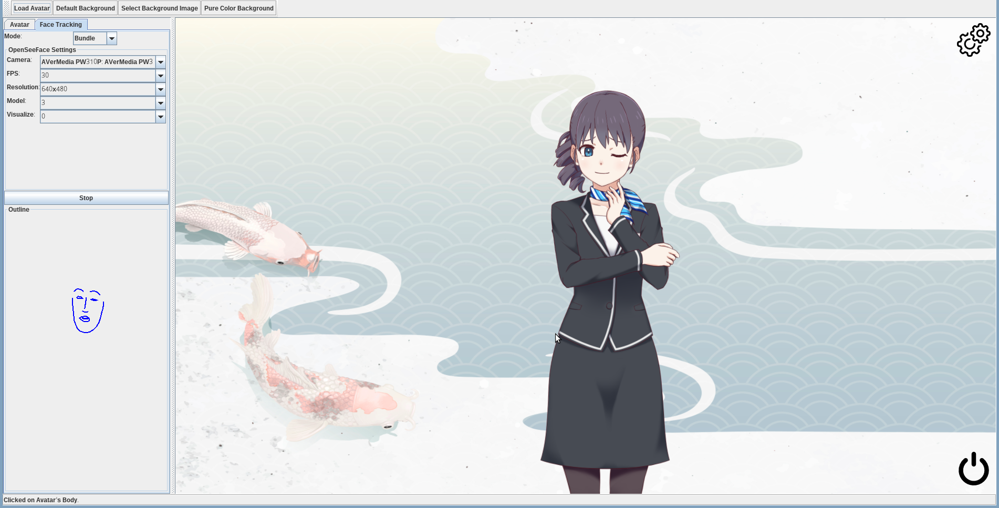
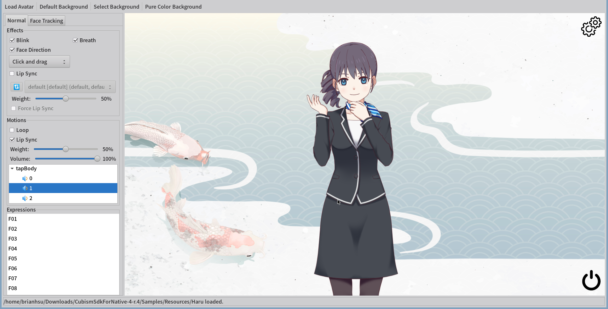

Live2D For Scala (JVM / Linux / Windows / MacOS Intel)
================================================
[](https://github.com/brianhsu/mavenRepository/) 

 


Disclaimer
-----------

1. This project is **NOT** affiliate nor endorsed Live2D Inc, explicitly or implicitly.
2. This is a project that helps me learning how to interact with native libraries in Scala/JVM, and how to apply Clean Architecture in a real life scenario. Because such, although the core library of this project is relative fully featured, it should **NOT** be considered as a replacement for the official Live 2D Cubism SDK.
3. As above, this project may be abandoned if I don't interested in this topic anymore. Use it at your own risk.

Background
-----------

I'm tired that there is no good webcam to Live2D program in Linux. Although the [facial-landmarks-for-cubism][0] provides a functional program, it requires user to have some decent knowledge about how to patch and build a C++ program in order to use.

The ultimate goal of whole project is to provide something like [VTuber Studio][1] in the Linux world. Maybe with less features, but should be with a good out-of-box experience. 

This repository primary foucs on the core library, although it also comes with Java Swing / SWT GUI example applications that demonstrate the possibility of this library. But they are just for demo, not a fully featured application and might contains lots of bug.

The core idea of this project it that by leverage the [Clean Architecture][2] concept proposed by Robert C. Martin (Uncle Bob), combined with it's written in Scala/JVM, it should able to run on both Linux / Windows / MacOS without the change in the source code.

### Acknowledgement

This project is heavily inspired by [facial-landmarks-for-cubism][0]. More specifically, the algorithm about how to convert OpenSeeFace data point into Live2D parameter in this project, are ported from [facial-landmarks-for-cubism][0].

Screenshots
--------------------

### Swing + JOGL Version Under Linux




### SWT+LWJGL Version under Linux



Feature
--------------------

The core library support much the same functionality you will find in the official Cubism SDK for Native and the sample application of it.

The following list shows features that this project currently supports or plan to be implemented.

### Feature Included in Official Cubism SDK for Native.
  - [x] Motion (Loop or single time)
  - [x] Model motion event listener
  - [x] Expression
  - [x] Physics
  - [x] Auto eye-blink
  - [x] Auto breath effect
  - [x] Face direction control by mouse
  - [x] Lip sync from .WAV file in the avatar motion

### Advance Feature
  - [x] Lip sync from microphone
  - [x] Use webcam to control Live2D avatar (VTuber like)

### Won't Implemented Feature

Some feature inside Cubism SDK for Native is dropped intended. Because I think these feature are not really useful for create a VTuber program. 

The following is the list of such features.

  - Priority motion queue

Supported Platforms
--------------------

Since this project is built on Clean Architecture concept and runs on Java Virtual Machine, it's able to use different Java OpenGL binding API. By default, it provids [JavaOpenGL][3] binding and [LWJGL][4] + [SWT][5] binding.

In theory, it should able to use differnt combination of OpenGL Java libary and GUI toolkit, but the examples come with this project use the following comination.

Due to some weired bug, I couldn't make the example program runs on SWT under MacOS. I've confirmed JavaOpenGL binding could work under Intel and Apple M2 chip. I don't have other Apple chips to verify, so not sure if it will work or not.

| OS / Binding  | Architecture | OpenGL Binding     | GUI Toolkit |Supported          | Note
| ------------- |------------- | ------------------ |------------ |------------------ |------
| Linux         | x86_64       | JavaOpenGL         | Swing       |:heavy_check_mark: | 1
| Linux         | x86_64       | LWJGL              | SWT         |:heavy_check_mark: | 2
| Windows 10    | x86_64       | JavaOpenGL         | Swing       |:heavy_check_mark: |
| Windows 10    | x86_64       | LWJGL              | SWT         |:heavy_check_mark: |
| MacOS         | x86_64 / M2  | JavaOpenGL         | Swing       |:heavy_check_mark: | 
| MacOS         | x86_64 / M2  | LWJGL              | SWT         |:x:                | 

1. Works both on X11 / Wayland natively.
2. Works on X11 natively, you need set `GDK_BACKEND=x11` environment variable to make it work on Wayland.

Usage
--------------------

To use this library, you could pull it from a custom Maven repository. You may find the latest version number on the top of this page.

This library is split into the following components. See modules/README.md for detailed documentation of each component and how to use this project's core library in your own project to control Live / render Live2D model.

The following are example of how to include this library inside a SBT project.

```scala
resolvers += "Live 2D For Scala" at "https://raw.githubusercontent.com/brianhsu/mavenRepository/master"

libraryDependencies += "moe.brianhsu.live2d" %% "core" % "x.y.z" // The core library.
libraryDependencies += "moe.brianhsu.live2d" %% "jogl-binding" % "x.y.z" // The Java OpenGL Binding.
libraryDependencies += "moe.brianhsu.live2d" %% "lwjgl-binding" % "x.y.z" // The LWJGL(Lightweight Java Game Library) binding.
libraryDependencies += "moe.brianhsu.live2d" %% "swt" % "x.y.z" // The LWJGL(Lightweight Java Game Library) + SWT binding.
```

Demo Application
--------------------

This project comes with example applications to demonstrate what this library is capable of. Please note that the example application is just a demo, it might never become a fully featured VTuber studio program in near future. That would be a differnt topic.

You could find the latest demo application located at [GitHub Release Page](https://github.com/brianhsu/Live2DForScala/releases) with detailed instruction on how to run the example application and basic control scheme of example program.

Change Log
-------------------

You may find the revision history of this library in [CHANGELOG.md](Changelog.md).

Project Structure and Design
-----------------------------

Since the project follows the Clean Architecture design philosophy, it's seperated into multiple modules. Those modules are SBT sub-projects under the `modules` directory.

The following is the overview of this project's structure and breif explanation on each of those modules.

See [modules/README.md](modules/README.md) for detailed documentation of each component and how to use this project's core library in your own project to control Live / render Live2D model.

```console
.
├── build.sbt   # SBT build definition
├── doc
├── modules     
│   ├── core         # The core library to control / render Live2D model.
│   ├── joglBinding  # The Java OpenGL binding
│   ├── lwjglBinding # The LWJGL binding
│   ├─── swtBinding  # The SWT GLCanvas binding
│   └──── examples
│      ├── base      # The base demo application without any GUI toolkit dependency. 
│      ├── swing     # The full Swing version demo application.
│      ├── swt       # The SWT version demo application without SWT runtime.
│      ├── swt-linux-bundle   # The SWT version demo application with Linux SWT runtime.
│      └── swt-windows-bundle # The SWT version demo application with Windows SWT runtime.
├── publish.sbt # Maven publish settings
├── release.sbt # Release settings
├── README.md  
└── version.sbt # Version settings
```

Build Instruction
--------------------

To build this library manually, please follow the instruction in [doc/BUILD.md](doc/BUILD.md).


Contribution
-------------

If you find any bugs, you could report it under the [GitHub Issue](https://github.com/brianhsu/Live2DForScala/issues) tab.

You are more then welcome to send pull request to this project. Here are some guidelines for pull requests:

1. `master` branch are reserved for release a new version, please base your code on `develop` branch. `devlope` branch contains all the latest code.
2. Please send pull request to `develop` branch.
3. Large pull request is hard to do a meaningful review, please consider [split large PR to small PR](https://google.github.io/eng-practices/review/developer/small-cls.html).
4. Please run unit test and make sure everything passed before sending a PR.

License
==============================

The library and the example program of this project itself is licensed under the MIT license. Please note that this repository also contains files that are belong to other copyright holders, please see the following section for detail. Those files are not considered as "ths project itself" in previous sentence.

You must agree to those license agreement in order to use this program.

3rd Party Component Licenses
==============================

This project is based on some 3rd party resources, the following denoted those resources and thier licenses.

Live2D Cubism Core
--------------------

This project uses Live2D Cubism Core native library during runtime, it's located at `modules/core/src/main/resources/`.

```
modules/core/src/main/resources/linux-x86-64/libLive2DCubismCore.so
modules/core/src/main/resources/win32-x86-64/Live2DCubismCore.dll
modules/core/src/main/resources/win32-x86-64/Live2DCubismCore.lib
modules/core/src/main/resources/darwin/libLive2DCubismCore.dylib
modules/core/src/main/resources/LICENSE.md
```

Live2D Cubism Core is available under Live2D Proprietary Software License.

* [Live2D Proprietary Software License Agreement](https://www.live2d.com/eula/live2d-proprietary-software-license-agreement_en.html)
* [Live2D Proprietary Software 使用許諾契約書](https://www.live2d.com/eula/live2d-proprietary-software-license-agreement_jp.html)
* [Live2D Proprietary Software 使用授权协议](https://www.live2d.com/eula/live2d-proprietary-software-license-agreement_cn.html)

Live2D Model
--------------------

In order to do proper unit test to make sure this project's quality, the Live2D model located at `modules/core/src/test/resources/models` are used during unit test. And is included in this project's git repository.

We used it under the Free Material License Agreement from Live2D Inc.

* [Free Material License Agreement](https://www.live2d.com/eula/live2d-free-material-license-agreement_en.html)
* [無償提供マテリアルの使用許諾契約書](https://www.live2d.com/eula/live2d-free-material-license-agreement_jp.html)
* [无偿提供素材使用授权协议](https://www.live2d.com/eula/live2d-free-material-license-agreement_cn.html)

facial-landmarks-for-cubism
-----------------------------

The OpenSeeFace data point to Live2D parameters' algorithm in this project is mainly from [adrianiainlam/facial-landmarks-for-cubism][0]. 

Although this project does not include the original C++ version source code, it includes comments which could be found at above project regrading the explanation of various calculation.

[facial-landmarks-for-cubism][0] is released under MIT License with the following declaration:

```
Copyright (c) 2020 Adrian I. Lam

Permission is hereby granted, free of charge, to any person obtaining a copy
of this software and associated documentation files (the "Software"), to deal
in the Software without restriction, including without limitation the rights
to use, copy, modify, merge, publish, distribute, sublicense, and/or sell
copies of the Software, and to permit persons to whom the Software is
furnished to do so, subject to the following conditions:

The above copyright notice and this permission notice shall be included in all
copies or substantial portions of the Software.

THE SOFTWARE IS PROVIDED "AS IS", WITHOUT WARRANTY OF ANY KIND, EXPRESS OR
IMPLIED, INCLUDING BUT NOT LIMITED TO THE WARRANTIES OF MERCHANTABILITY,
FITNESS FOR A PARTICULAR PURPOSE AND NONINFRINGEMENT. IN NO EVENT SHALL THE
AUTHORS OR COPYRIGHT HOLDERS BE LIABLE FOR ANY CLAIM, DAMAGES OR OTHER
LIABILITY, WHETHER IN AN ACTION OF CONTRACT, TORT OR OTHERWISE, ARISING FROM,
OUT OF OR IN CONNECTION WITH THE SOFTWARE OR THE USE OR OTHER DEALINGS IN THE
SOFTWARE.
```

OpenSeeFace
--------------

### OpenSeeFace

The released package contains a bundled pre-built [OpenSeeFace][0] executable binary, which is released under `BSD-2-Clause` license.

### Dependencies

The bunlded OpenSeeFace package also contains it's dependencies, namely:

 - [OpenCV](https://opencv.org/) released under Apache License.
 - [ONNX Runtime](https://pypi.org/project/ort-nightly/) released under MIT License.
 - [Pillow](https://pypi.org/project/Pillow/) released under Historical Permission Notice and Disclaimer.
 - [Numpy](https://pypi.org/project/numpy/) released under BSD License.

Background
--------------

The default background in the example program is licensed under [Freepik License][6] by:

- [Japanese koi vector created by rawpixel.com - www.freepik.com][7]

Icons
--------------

The power / gear / speaker icons in the example are licensed under [Flaticon License][8]  by:

- [Power icons created by Gregor Cresnar - Flaticon][9]
- [Settings icons created by Gregor Cresnar Premium - Flaticon][10]
- [Speaker icons created by Freepik - Flaticon][11]

[0]: https://github.com/adrianiainlam/facial-landmarks-for-cubism
[1]: https://store.steampowered.com/app/1325860/VTube_Studio/
[2]: https://blog.cleancoder.com/uncle-bob/2012/08/13/the-clean-architecture.html
[3]: https://jogamp.org/jogl/www/
[4]: https://www.lwjgl.org/
[5]: https://www.eclipse.org/swt/
[6]: https://www.freepikcompany.com/legal#nav-freepik-license
[7]: https://www.freepik.com/vectors/japanese-koi
[8]: https://www.freepikcompany.com/legal#nav-flaticon
[9]: https://www.flaticon.com/free-icons/power
[10]: https://www.flaticon.com/free-icons/settings
[11]: https://www.flaticon.com/free-icons/speaker
