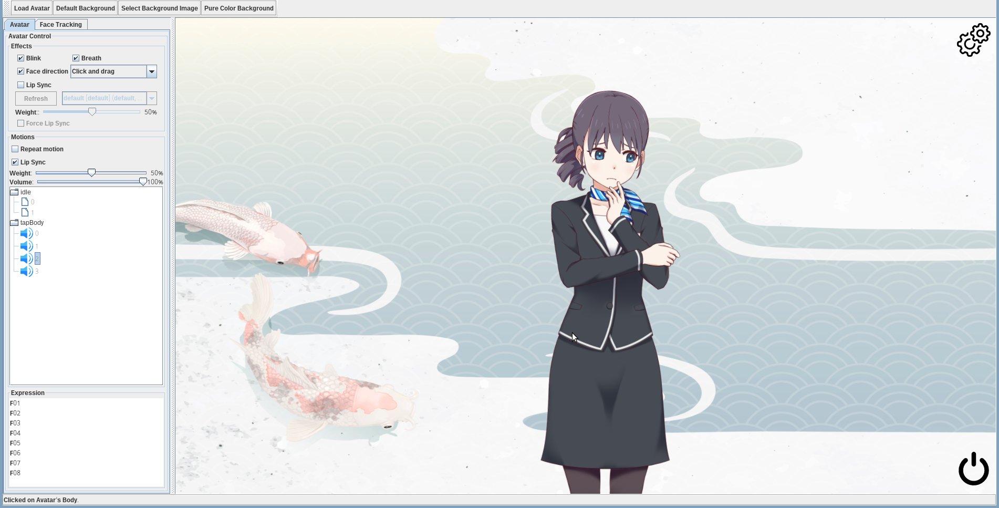

Live2D For Scala (JVM / Linux / Windows / MacOS Intel)
================================================
[](https://github.com/brianhsu/mavenRepository/) 

 


ja_JP [日本語](README.ja_JP.md)   zh_CN [简体中文](README.zh_CN.md)
---


免责声明
-----------

1. 这个项目并非Live2D Inc的关联项目，也不受其明确或暗示的认可。
2. 这个项目是为了帮助我学习如何在Scala/JVM中与本地库交互，以及如何在实际场景中应用清洁架构。因此，尽管这个项目的核心库功能相对完备，但它不应被视为官方Live 2D Cubism SDK的替代品。
3. 如上所述，如果我对这个主题不再感兴趣，这个项目可能会被废弃。使用它风险自负。

背景
-----------


我厌倦了在Linux上没有好用的Live2D程序摄像头。尽管[facial-landmarks-for-cubism][0]提供了一个功能性的程序，但它需要用户具备一些关于如何修补和构建C++程序的相当知识才能使用。

这个项目的最终目标是提供一个类似[VTuber Studio][1]的东西在Linux世界里。也许功能少一些，但应该有一个良好的开箱即用体验。

这个项目的整个想法是利用罗伯特·C·马汀（Uncle Bob）提出的[Clean Architecture][2]概念，并结合它用Scala/JVM编写，应该能够在不需要更改源代码的情况下在Linux / Windows / MacOS Intel上运行。

### 致谢
这个项目受到了[facial-landmarks-for-cubism][0]的深刻启发。更具体地说，这个项目中关于如何将OpenSeeFace数据点转换为Live2D参数的算法，是从[facial-landmarks-for-cubism][0]移植过来的。

截图
--------------------

### Swing + JOGL Version Under Linux



### SWT+LWJGL Version under Linux


特性
--------------------

核心库支持与官方Cubism SDK for Native及其示例应用程序中的功能大致相同。

以下列表展示了该项目当前支持的功能以及计划实现的功能。

官方Cubism SDK for Native支持的功能：

   - [x] 运动（循环或单次）
   - [x] 模型运动事件监听器
   - [x] 表情
 -   [x] 物理效果
  -  [x] 自动眨眼
 -   [x] 自动呼吸效果
 -   [x] 通过鼠标控制面部方向
 -   [x] 从avatar动作中的.WAV文件进行口型同步

高级功能：

  -  [x] 从麦克风进行口型同步
   - [x] 使用网络摄像头控制Live2D角色（类似于VTuber）

### 未实现特性

在Cubism SDK for Native中有一些特性被故意放弃了。因为我认为这些特性对于创建一个VTuber程序并不是非常有用。

以下是这样的特性列表。

  - 优先级运动队列

TODO List
--------------------

  -  [ ] 通过UI控制OpenSeeFace -> Live2D模型运动参数。
  -  [ ] 通过面部追踪实现Live2D模型身体动作。

支持的平台
--------------------

由于该项目基于 Clean Architecture 概念构建，并且运行在 Java 虚拟机上，因此它能够使用不同的 Java OpenGL 绑定 API。默认情况下，它提供了 [JavaOpenGL][3] 绑定和 [LWJGL][4] + [SWT][5] 绑定。

理论上，它应该能够使用不同组合的 OpenGL Java 库和 GUI 工具包，但是该项目提供的示例使用了以下组合。

由于一些奇怪的错误，我无法使示例程序在 macOS 下使用 SWT 运行。此外，目前它只支持运行在 Intel 处理器的 MacOS 上，不支持 Apple M1 版本的 MacOS。

| OS / Binding  | Architecture | OpenGL Binding     | GUI Toolkit |Supported          | Note
| ------------- |------------- | ------------------ |------------ |------------------ |------
| Linux         | x86_64       | JavaOpenGL         | Swing       |:heavy_check_mark: |
| Linux         | x86_64       | LWJGL              | SWT         |:heavy_check_mark: |
| Windows 10    | x86_64       | JavaOpenGL         | Swing       |:heavy_check_mark: |
| Windows 10    | x86_64       | LWJGL              | SWT         |:heavy_check_mark: |
| MacOS         | x86_64       | JavaOpenGL         | Swing       |:heavy_check_mark: | 1
| MacOS         | x86_64       | LWJGL              | SWT         |:x:                | 

1. 必须使用 jogamp-fat-v2.4.0-rc-20210111.jar，从 Maven Central 自动拉取依赖项将不起作用。

安装和使用
--------------------

请参阅 doc/INSTALL.md 文件，以获取有关如何下载演示应用程序和示例Live 2D模型的详细说明。

演示应用程序的Swing和SWT版本提供相同的功能。以下是一些基本控制方案：

  在顶部左角点击“加载头像”按钮以加载Live2D模型。

 1.1 您必须选择一个包含有效 .moc3 文件的文件夹。
    
   左侧的用户面板用于控制效果/动作/表情。

  右键点击头像并拖动以移动头像。

 使用鼠标滚轮进行放大/缩小头像。

项目结构和设计
-----------------------------

由于该项目遵循 Clean Architecture 设计哲学，因此它被分离成多个模块。这些模块是位于 modules 目录下的 SBT 子项目。

以下是对该项目结构的总览以及每个模块的简要说明。

请参阅 modules/README.md 以获取每个组件的详细文档以及如何在您自己的项目中使用此项目的核心库来控制 Live2D 模型渲染。

```console
.
├── build.sbt   # SBT 构建定义
├── doc
├── modules     
│   ├── core         # 用于控制 / 渲染 Live2D 模型的核心库
│   ├── joglBinding  # Java OpenGL 绑定
│   ├── lwjglBinding # LWJGL 绑定
│   ├── ── swtBinding  # SWT GLCanvas 绑定
│   └── ── examples
│       ├── base      # 没有 GUI 工具包依赖的基础演示应用程序
│       ├── swing     # 完整的 Swing 版本演示应用程序
│       ├── swt       # 没有 SWT 运行时的 SWT 版本演示应用程序
│       ├── swt-linux-bundle   # 带有 Linux SWT 运行时的 SWT 版本演示应用程序
│       └── swt-windows-bundle # 带有 Windows SWT 运行时的 SWT 版本演示应用程序
├── publish.sbt # Maven 发布设置
├── release.sbt # 发布设置
├── README.md  
└── version.sbt # 版本设置
```


Build Instruction
--------------------

1. 安装 OpenJDK 11

    对于 Windows，请下载 Microsoft Build of OpenJDK 并安装它。
    对于 Linux，请通过您的发行版的包管理器安装它。
    对于 macOS
        安装 Homebrew。
        运行 brew install openjdk@11 以安装。

2. 安装 [SBT][6]（Simple Build Tool）

    遵循 SBT 的 下载 页面以安装它。

3. 编译

1. 在安装完 SBT 之后，运行以下命令从 GitHub 克隆这个项目。

```console
username@hostname:~$ git clone https://github.com/brianhsu/Live2DForScala.git
Cloning into 'Live2DForScala'...
remote: Enumerating objects: 10853, done.
remote: Counting objects: 100% (30/30), done.
remote: Compressing objects: 100% (23/23), done.
remote: Total 10853 (delta 6), reused 22 (delta 1), pack-reused 10823
Receiving objects: 100% (10853/10853), 67.14 MiB | 7.30 MiB/s, done.
Resolving deltas: 100% (4483/4483), done.

username@hostname:~$
```

2. 进入该项目目录，并输入 sbt 来运行 SBT 控制台。首次执行时可能需要一些时间来下载文件。

```console
username@hostname:~$ cd Live2DForScala
username@hostname:~/Live2DForScala$ sbt
copying runtime jar...
[info] [launcher] getting org.scala-sbt sbt 1.5.8  (this may take some time)...
:: loading settings :: url = jar:file:/usr/share/sbt-bin/lib/sbt-launch.jar!/org/apache/ivy/core/settings/ivysettings.xml
:: loading settings :: url = jar:file:/usr/share/sbt-bin/lib/sbt-launch.jar!/org/apache/ivy/core/settings/ivysettings.xml
....
[info] welcome to sbt 1.5.8 (Eclipse Adoptium Java 11.0.15)
[info] loading global plugins from /home/brianhsu/.sbt/1.0/plugins
[info] loading settings for project live2dforscala-build from plugins.sbt ...
[info] loading project definition from /home/brianhsu/Live2DForScala/project
[info] loading settings for project core from build.sbt ...
[info] loading settings for project lwjglBinding from build.sbt ...
[info] loading settings for project live2dforscala from build.sbt,publish.sbt,version.sbt ...
[info] set current project to live2dforscala (in build file:/home/brianhsu/Live2DForScala/)
[info] sbt server started at local:///home/brianhsu/.sbt/1.0/server/7f96e432f44ce5ee45c1/sock
[info] started sbt server
sbt:live2dforscala> 
```

3. 在 SBT 控制台中输入 compile 来编译项目。

```console
sbt:live2dforscala> compile
[info] compiling 154 Scala sources and 1 Java source to /home/brianhsu/Live2DForScala/modules/core/target/scala-2.13/classes ...
[info] Non-compiled module 'compiler-bridge_2.13' for Scala 2.13.8. Compiling...
[info]   Compilation completed in 4.259s.
[info] compiling 2 Scala sources to /home/brianhsu/Live2DForScala/modules/lwjglBinding/target/scala-2.13/classes ...
[info] compiling 1 Scala source to /home/brianhsu/Live2DForScala/modules/swtBinding/target/scala-2.13/classes ...
[info] compiling 3 Scala sources to /home/brianhsu/Live2DForScala/modules/joglBinding/target/scala-2.13/classes ...
[info] compiling 7 Scala sources to /home/brianhsu/Live2DForScala/modules/examples/base/target/scala-2.13/classes ...
[info] compiling 8 Scala sources to /home/brianhsu/Live2DForScala/modules/examples/swt/target/scala-2.13/classes ...
[info] compiling 8 Scala sources to /home/brianhsu/Live2DForScala/modules/examples/swing/target/scala-2.13/classes ...
sbt:live2dforscala> 
```

### 3. 编译

   - 在 SBT 控制台中输入 test 来运行单元测试。
   - 由于 macOS 不支持 SWT+JWJGL，SWTOpenGLCanvasInfoFeature 会失败。这是预期的。

```console
sbt:live2dforscala> test
[info] compiling 1 Scala source to /home/brianhsu/Live2DForScala/modules/swtBinding/target/scala-2.13/test-classes ...
[info] compiling 1 Scala source to /home/brianhsu/Live2DForScala/modules/lwjglBinding/target/scala-2.13/test-classes ...
[info] compiling 3 Scala sources to /home/brianhsu/Live2DForScala/modules/joglBinding/target/scala-2.13/test-classes ...
[info] Run completed in 326 milliseconds.
[info] Total number of tests run: 2
[info] Suites: completed 1, aborted 0
[info] Tests: succeeded 2, failed 0, canceled 0, ignored 0, pending 0
[info] All tests passed.
[info] SWTOpenGLCanvasInfoFeature:
[info] Feature: Get canvas information
[info]   Scenario: Get canvas information from SWT OpenGL Canvas
....
[info] Tests: succeeded 394, failed 0, canceled 0, ignored 0, pending 0
[info] All tests passed.
sbt:live2dforscala> 
```

### 3. Run Demo Application

Type the following command in SBT console to run the demo application.

- `exampleSwing/run` to run Swing version. Works for Linux / Windows / MacOS.
- `exampleSWTLinux/run` to run SWT version on Linux.
- `exampleSWTWin/run` to run SWT version on Windows.

```console
sbt:live2dforscala> exampleSwing/run
[info] running (fork) moe.brianhsu.live2d.demo.swing.SwingMain 
```

```console
sbt:live2dforscala> exampleSWTLinux/run                    
[info] running (fork) moe.brianhsu.live2d.demo.swing.SwingMain
```

License
==============================

The library and the example program of this project itself is licensed under the MIT license. Please note that this repository also contains files that are belong to other copyright holders, please see the following section for detail. Those files are not considered as "ths project itself" in previous sentence.

You must agree to those license agreement in order to use this program.

3rd Party Component Licenses
==============================

This project is based on some 3rd party resources, the following denoted those resources and thier licenses.

Live2D Cubism Core
--------------------

This project uses Live2D Cubism Core native library during runtime, it's located at `modules/core/src/main/resources/`.

```
modules/core/src/main/resources/linux-x86-64/libLive2DCubismCore.so
modules/core/src/main/resources/win32-x86-64/Live2DCubismCore.dll
modules/core/src/main/resources/win32-x86-64/Live2DCubismCore.lib
modules/core/src/main/resources/darwin/libLive2DCubismCore.dylib
modules/core/src/main/resources/LICENSE.md
```

Live2D Cubism Core is available under Live2D Proprietary Software License.

* [Live2D Proprietary Software License Agreement](https://www.live2d.com/eula/live2d-proprietary-software-license-agreement_en.html)
* [Live2D Proprietary Software 使用許諾契約書](https://www.live2d.com/eula/live2d-proprietary-software-license-agreement_jp.html)
* [Live2D Proprietary Software 使用授权协议](https://www.live2d.com/eula/live2d-proprietary-software-license-agreement_cn.html)

Live2D Model
--------------------

In order to do proper unit test to make sure this project's quality, the Live2D model located at `modules/core/src/test/resources/models` are used during unit test. And is included in this project's git repository.

We used it under the Free Material License Agreement from Live2D Inc.

* [Free Material License Agreement](https://www.live2d.com/eula/live2d-free-material-license-agreement_en.html)
* [無償提供マテリアルの使用許諾契約書](https://www.live2d.com/eula/live2d-free-material-license-agreement_jp.html)
* [无偿提供素材使用授权协议](https://www.live2d.com/eula/live2d-free-material-license-agreement_cn.html)

facial-landmarks-for-cubism
-----------------------------

The OpenSeeFace data point to Live2D parameters' algorithm in this project is mainly from [adrianiainlam/facial-landmarks-for-cubism][0]. 

Although this project does not include the original C++ version source code, it includes comments which could be found at above project regrading the explanation of various calculation.

[facial-landmarks-for-cubism][0] is released under MIT License with the following declaration:

```
Copyright (c) 2020 Adrian I. Lam

Permission is hereby granted, free of charge, to any person obtaining a copy
of this software and associated documentation files (the "Software"), to deal
in the Software without restriction, including without limitation the rights
to use, copy, modify, merge, publish, distribute, sublicense, and/or sell
copies of the Software, and to permit persons to whom the Software is
furnished to do so, subject to the following conditions:

The above copyright notice and this permission notice shall be included in all
copies or substantial portions of the Software.

THE SOFTWARE IS PROVIDED "AS IS", WITHOUT WARRANTY OF ANY KIND, EXPRESS OR
IMPLIED, INCLUDING BUT NOT LIMITED TO THE WARRANTIES OF MERCHANTABILITY,
FITNESS FOR A PARTICULAR PURPOSE AND NONINFRINGEMENT. IN NO EVENT SHALL THE
AUTHORS OR COPYRIGHT HOLDERS BE LIABLE FOR ANY CLAIM, DAMAGES OR OTHER
LIABILITY, WHETHER IN AN ACTION OF CONTRACT, TORT OR OTHERWISE, ARISING FROM,
OUT OF OR IN CONNECTION WITH THE SOFTWARE OR THE USE OR OTHER DEALINGS IN THE
SOFTWARE.
```

OpenSeeFace
--------------

### OpenSeeFace

The released package contains a bundled pre-built [OpenSeeFace][0] executable binary, which is released under `BSD-2-Clause` license.

### Dependencies

The bunlded OpenSeeFace package also contains it's dependencies, namely:

 - [OpenCV](https://opencv.org/) released under Apache License.
 - [ONNX Runtime](https://pypi.org/project/ort-nightly/) released under MIT License.
 - [Pillow](https://pypi.org/project/Pillow/) released under Historical Permission Notice and Disclaimer.
 - [Numpy](https://pypi.org/project/numpy/) released under BSD License.

Background
--------------

The default background in the example program is licensed under [Freepik License][11] by:

- [Japanese koi vector created by rawpixel.com - www.freepik.com][7]

Icons
--------------

The power / gear / speaker icons in the example are licensed under [Flaticon License][12]  by:

- [Power icons created by Gregor Cresnar - Flaticon][8]
- [Settings icons created by Gregor Cresnar Premium - Flaticon][9]
- [Speaker icons created by Freepik - Flaticon][10]

[0]: https://github.com/adrianiainlam/facial-landmarks-for-cubism
[1]: https://store.steampowered.com/app/1325860/VTube_Studio/
[2]: https://blog.cleancoder.com/uncle-bob/2012/08/13/the-clean-architecture.html
[3]: https://jogamp.org/jogl/www/
[4]: https://www.lwjgl.org/
[5]: https://www.eclipse.org/swt/
[6]: https://www.scala-sbt.org/
[7]: https://www.freepik.com/vectors/japanese-koi
[8]: https://www.flaticon.com/free-icons/power
[9]: https://www.flaticon.com/free-icons/settings
[10]: https://www.flaticon.com/free-icons/speaker
[11]: https://www.freepikcompany.com/legal#nav-freepik-license
[12]: https://www.freepikcompany.com/legal#nav-flaticon
